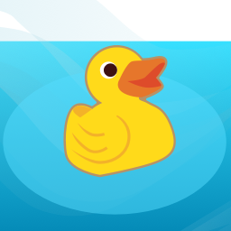

# Streamtoy client

StreamToy is a framework for attaching a Godot based applications and games to a streamer service to trigger actions in Godot when certain events in streams happen.

This repository holds the StreamToy client that connects to a [StreamToy](https://github.com/deep-entertainment/godot-stream-toy) server
and subscribes to twitch events.

Please check out the [StreamToy game template repository](https://github.com/deep-entertainment) for details.

# Issues

See the [deep entertainment issues repository](https://github.com/deep-entertainment/issues/issues) if you have problems or new ideas for the project.
